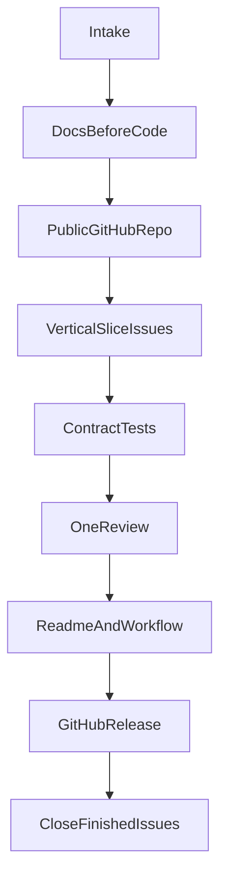

# Workflow

```mermaid
flowchart TD
  intake[Intake] --> docs[DocsBeforeCode]
  docs --> repo[PublicGitHubRepo]
  repo --> issues[VerticalSliceIssues]
  issues --> tests[ContractTests]
  tests --> review[OneReview]
  review --> readme[ReadmeAndWorkflow]
  readme --> release[GitHubRelease]
  release --> closeout[CloseFinishedIssues]
```
